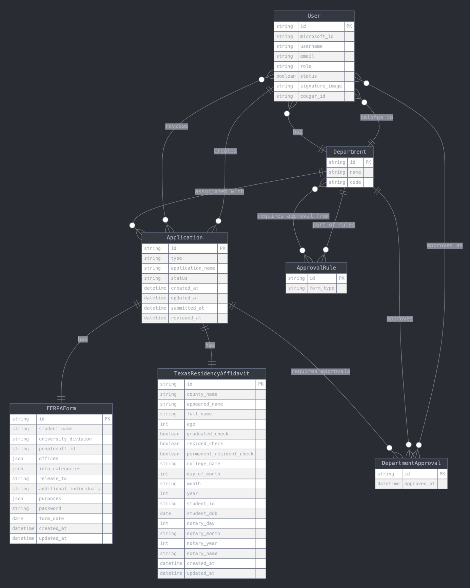
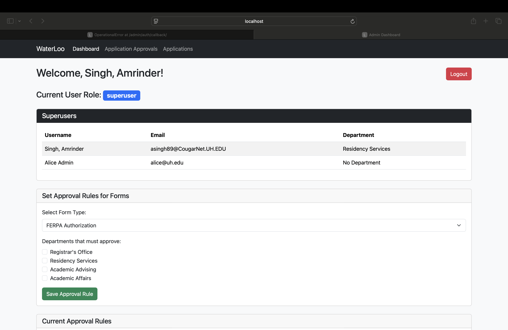
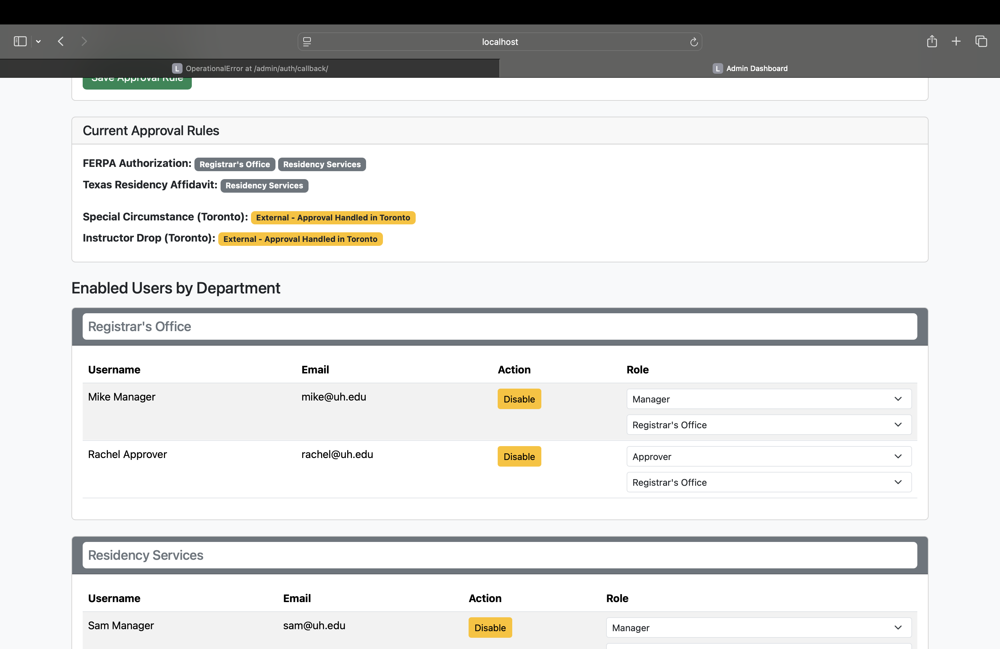
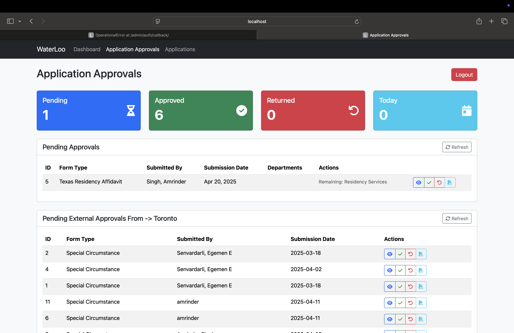
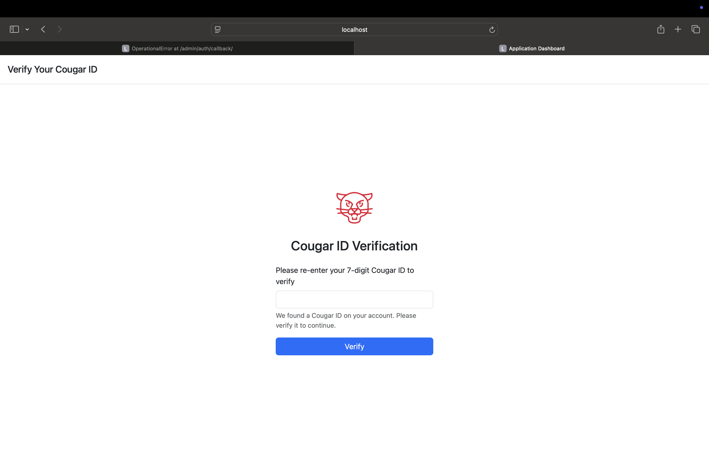
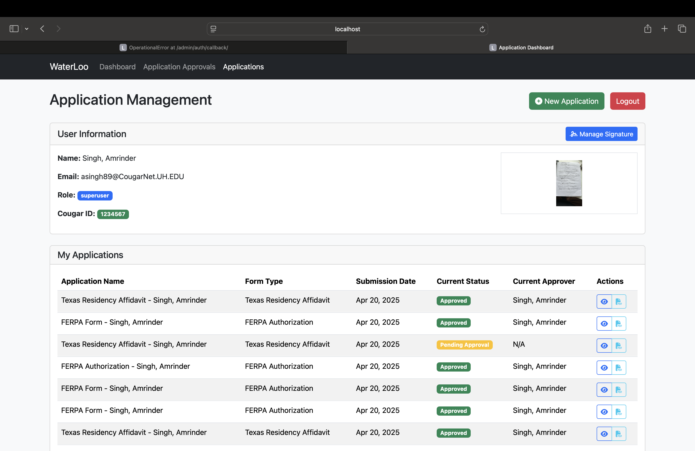
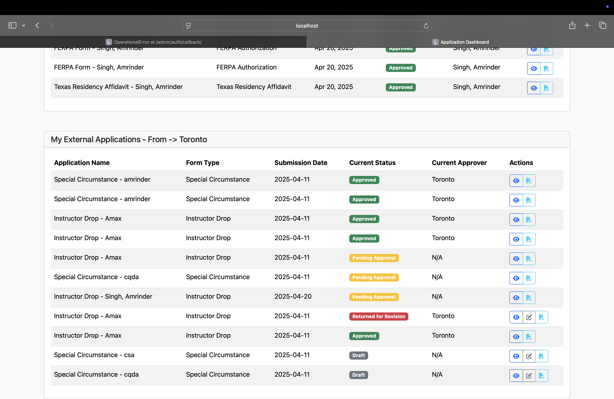

# COSC-4353-Group-Project - v4

A full-stack academic forms management system built by two teams (Waterloo & Toronto) for the University of Houston. Students can submit, track, and manage academic forms (FERPA, Texas Residency Affidavit, Course Drop, Special Circumstance) with role-based approval workflows and PDF generation via LaTeX.

---

## 🏗️ Project Structure

```
├── Waterloo_Website/               # Django app (Team Waterloo)
└── Web-Based-User-Management/      # Flask app (Team Toronto)
```

### Waterloo (Django)
- Microsoft Azure OAuth authentication
- Role-based access: `superuser`, `manager`, `approver`, `basicuser`
- Forms: FERPA Authorization, Texas Residency Affidavit
- PDF generation via LaTeX (`pdflatex`)
- Department-based multi-approval workflows
- Cougar ID verification
- SQLite database (configurable to PostgreSQL)

### Toronto (Flask)
- Microsoft 365 OAuth authentication
- Admin dashboard for user management (create, update, delete, roles)
- Forms: Special Circumstance, Course Drop
- PDF generation via LaTeX + `fpdf`
- PostgreSQL database with Flask-Migrate
- REST API at `/api/forms` and `/api/users`

---

## 🚀 To Run

Run each Docker file from the `waterloo` and `toronto` folders independently.

### Waterloo (Django) — Port 8000

```bash
cd Waterloo_Website
# Create a .env file first (see below)
docker-compose build --no-cache
docker-compose up
```

**Required `.env` variables:**
```
SECRET_KEY=your_secret_key
DEBUG=True
MICROSOFT_CLIENT_ID=your_client_id
MICROSOFT_TENANT_ID=your_tenant_id
MICROSOFT_CLIENT_SECRET=your_client_secret
REDIRECT_URI=http://localhost:8000/admin/login/
SQLITE_DB_NAME=waterloo.sqlite3
TIME_ZONE=America/Chicago
STATIC_ROOT=/app/static
```

Then open: 👉 [http://localhost:8000/admin/login/](http://localhost:8000/admin/login/)

---

### Toronto (Flask) — Port 7070

```bash
cd Web-Based-User-Management
# Create a .env file first (see below)
docker-compose up --build
```

**Required `.env` variables:**
```
CLIENT_ID=your_client_id
CLIENT_SECRET=your_client_secret
TENANT_ID=your_tenant_id
DATABASE_URL=postgresql://flaskuser:flaskpass@db/flaskdb
SECRET_KEY=your_secret_key
```

Then open: 👉 [http://localhost:7070](http://localhost:7070)

---

## 👥 Contributors

**Team Waterloo**
- Eric Parsons
- Amrinder Singh
- Amsal Moiz
- Subhan Hussain

**Team Toronto**
- Ash Elsaadi
- Hung K Liu
- Egemen Erkin Senvardarli

---

## 📸 Screenshots

### ER Diagram


### Login Page


### Dashboard


### Applications


### Form Selection


### Application Approvals


### PDF Preview


---

## 📄 License

MIT License — see [`Waterloo_Website/LICENSE`](Waterloo_Website/LICENSE) and [`Web-Based-User-Management/LICENSE`](Web-Based-User-Management/LICENSE).
